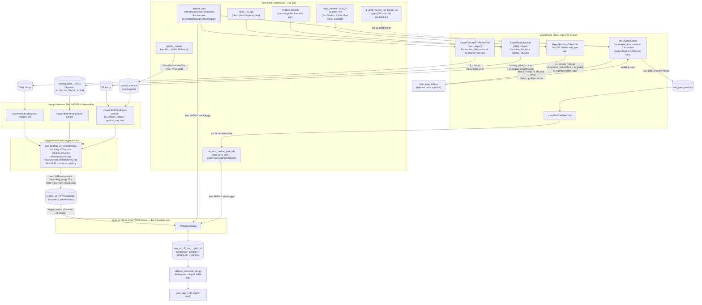

# Sơ đồ luồng data WFO canonical 1-phút (TASK-251) — để rà soát chỗ lệch

## 1. Sơ đồ (Mermaid)

## 2. Mô tả chi tiết từng khối (đọc thẳng từ code, không suy đoán)

### 2.1. `tool1_export` là gì
Class thật: `ExportFeaturesForPythonTool` (gói `fundingv2`), gọi qua CE atom `tool1_export`.

- **Input**: `market_data` (đọc 1 lần từ Aerospike qua `getAllMarketDataFromAerospike()`) + `symbol_mapper`.
- **Xử lý**: với mỗi phút, với mỗi coin alt-USDT đi qua filter (production thì qua `EntrySignalFilter`; canonical dùng `FF_UNFILTERED=1` để BỎ filter, giữ mọi coin trên lưới `FF_GRID_MIN` phút), trích 40 feature/coin qua `FundingDataCollectionManager.FundingFeatureExtractorV2`:
  - #1-21: momentum/dominance/RSI/funding cấp market + basket (giữ nguyên từ model 21-feature cũ đang live).
  - #22-26: funding sâu per-coin (percentile, z-score, persistence, sum24h, abs).
  - #27-28: volume per-coin (z-score, trend).
  - #29-32: cấu trúc giá per-coin (dist from high/low 24h, range position, ATR squeeze, relative strength vs BTC).
  - #33-35: cross-sectional rank CÙNG MỐC (funding/volumeZ/momentum rank giữa các coin tại đúng phút đó).
  - #36-40: microstructure 1 phút (ret15m, rvol15m, volumeZ5m, closePosRange15m, wickRatio15m).
- **KHÔNG chứa** feature OI/LS/taker (#41-45) — đó là tool riêng `ExportFundingOiPerCoin`, merge sau bằng `merge_asof` theo (symId, ts) ở bước train.
- **Output**: file `ff_*.bin.gz`, mỗi record 170 byte = `long ts (8B) + short symId (2B) + 40×float (160B)`.
- Đây là **feature CHO SELECTOR** (dự đoán coin nào sắp pump) — khác hoàn toàn với feature của gate (market-level, xem 2.4).

### 2.2. `label_export` (`ExportFundingLabel`)
- **Input**: `kline_1m_opt` (nến 1 phút thô, KHÔNG phải `market_data`) + `symbol_lifecycle` (universe, gồm cả coin đã chết).
- **Output**: `funding_label_1m.csv` — với mỗi (coin, mốc t), ghi "đường đi thô" trong tương lai tại **7 mốc horizon**: `{4h,12h,24h,72h,7d,14d,30d}` — mỗi mốc có 6 cột: `maxFav` (đỉnh thuận lợi), `maxAdv` (đáy bất lợi), `tHitFav`/`tHitAdv` (thời điểm chạm, phút), `retEnd` (return close-to-close), `nBars` (số nến thực có — thiếu = coin chết/data gap).
- Có sidecar `.meta.json` ghi `stepMinutes` thật, để phía train tự-validate không lệch grid.
- **Điểm cần Uni xem lại**: label sinh ra 7 horizon, nhưng kernel train hiện tại (`gen_funding_wf_predictions.py`) **chỉ dùng 4 horizon gốc** `{4h,12h,24h,72h}` và **chỉ dùng cột `maxFav`** (bỏ qua `maxAdv`, `tHitFav`, `tHitAdv`, `retEnd` hoàn toàn) để tạo nhãn nhị phân `y = (maxFav >= 0.06)`. 3 horizon dài `{7d,14d,30d}` hiện KHÔNG được dùng ở đâu trong luồng train này — có thể là dữ liệu để dành cho việc khác (bleed-thesis long-horizon) hoặc là chỗ lệch nếu Uni tưởng nó đã được dùng.

### 2.3. OI export (`ExportFundingOiPerCoin`)
- **Input**: các set Aerospike riêng cho OI/LS/taker (`open_interest`, `oi_ls_toptrader_acc/pos`, `oi_ls_global_acc`, `oi_taker_vol`) — nguồn dữ liệu HOÀN TOÀN khác `market_data`/`kline_1m_opt`, lấy từ REST API Binance (`/futures/data/openInterestHist`...) backfill trước đó.
- **Output**: `oi_percoin_<range>.bin.gz`, record 30 byte = `long ts + short symId + 5×float (oi_delta24h, oi_z, ls_global, ls_toptrader, taker_buy)`.
- Push lên Kaggle dưới tên cố định `oi_percoin_full.bin` (giải nén, không giữ `.gz`) + `symbol_map.csv` — đã làm hôm nay (phần 10 task file).

### 2.4. Gate (`WFOGateRunner` + `train_gate_fold.py` + `LoadWfoGatePredTool`)
- **Input**: CÙNG `market_data` như tool1_export, nhưng qua extractor KHÁC (`ComprehensiveMarketFeatureExtractor`) — trích **1 vector 33-channel MARKET-LEVEL/phút** (aggregate toàn thị trường, KHÔNG per-coin) — khác hẳn 40-channel per-coin của tool1_export.
- Label của gate lấy từ set gate CŨ `ai_pred_market_full_basket_v2` (chỉ lấy cột `predRisk4H`, biến `predReturn15M` mới được WFO tự train lại).
- **3 pha**: (1) replay 1 lần toàn range vào RAM (`featureStore`, ~350MB, KHÔNG nặng RAM như per-coin), (2) walk-forward expanding fold, mỗi fold gọi `train_gate_fold.py` (Python/xgboost, venv `xgb-env`) train → ONNX → predict đoạn OOS ngay từ RAM, (3) backtest ngoài (không thuộc luồng data chính).
- **Output CUỐI**: ghi file CSV cục bộ `wfo_gate_pred.csv` trước (network Aerospike ghi chậm, ~65 rec/s), rồi `LoadWfoGatePredTool` nạp 1 lần vào Aerospike set `ai_pred_market_gate_wfo`.
- **KHÔNG đi qua Kaggle** trong kiến trúc hiện tại — đây chính là điểm Uni vừa quyết đổi (phần 14 task file): sẽ đẩy file `wfo_gate_pred.csv` này lên Kaggle luôn, thay vì chỉ nạp Aerospike.

### 2.5. Kernel Kaggle `selector-predict-1m` (chạy TRÊN Kaggle, compute ở Kaggle không phải Oracle)
- Script thật: `ml/training/gen_funding_wf_predictions.py` (kernel `run_train.py` chỉ set env rồi gọi nó).
- Đọc 3 nguồn — TOÀN BỘ là FILE (Kaggle không có Aerospike): `TOOL1_GLOB` (ff_*.bin.gz), `OI_FILE` (oi_percoin_full.bin), `LABEL_CSV` (funding_label.csv), `MAP_CSV` (symbol_map.csv).
- Merge Tool1 + OI theo `(symId, ts)` bằng `merge_asof` (backward, tolerance 2h) → merge tiếp `symbol_map` theo `symId` rồi **DROP hàng không khớp symId** (đây là lỗ hổng tôi vá hôm nay — symbol_map.csv cũ thiếu ~81 symId mới).
- Train walk-forward expanding (mỗi fold: train tới `cutoff - purge(72h)`, predict đúng 1 block OOS 3 tháng disjoint) — `FIRST_CUTOFF=20230101` (lối A, đã chốt không đổi).
- **Output**: `predict_wf_YYYYMMDD.bin` — 1 file/fold, record 26 byte = `long ts + short symId + 4×float` (dự đoán xác suất pump cho từng horizon {4h,12h,24h,72h}).

### 2.6. `build_ds` (`WfoDataset.java`, chạy TRÊN Oracle, sau khi tải kết quả Kaggle về)
- Gộp **3 nguồn**: (1) `market_data` — đọc LIVE Aerospike (không qua Kaggle), (2) gate prediction — đọc LIVE Aerospike set `ai_pred_market_gate_wfo` (không qua Kaggle), (3) `predict_wf_*.bin` — tải VỀ từ Kaggle output (bước `kaggle_output`).
- Env quan trọng phải đúng: `WFO_SEL_HORIZON_IDX=0` (nghĩa 4h, không phải default 1=12h), `WFO_SET_PRED=ai_pred_market_gate_wfo` (không phải default `ai_pred_market_full_basket_v2`).
- **Output**: `wfo_ds_LF_1m_..._h4h_v1/` gồm `market.bin`, `pred.bin`, `funding.bin`, `manifest.txt`.
- Qua `validate_canonical_wfo.py` (leak-guard theo `expect_leakfree=2023-01-01`, off-grid %60000, NaN-fraction) rồi tới `gate_sign` (người duyệt, KHÔNG tự động).

## 3. Chỗ đáng chú ý / có thể lệch với kỳ vọng của Uni

1. **Label 7 horizon nhưng train chỉ dùng 4, chỉ dùng `maxFav`** — nếu Uni kỳ vọng model đang dùng cả `maxAdv`/`tHitFav`/`tHitAdv`/`retEnd`/3 horizon dài thì đây LÀ lệch thật, cần sửa `gen_funding_wf_predictions.py`.
2. **Gate và Selector dùng 2 extractor feature HOÀN TOÀN khác nhau** (33-channel market-level vs 40-channel per-coin) — đọc cùng `market_data` nhưng tính feature độc lập, không share code. Nếu có ý định "gate ảnh hưởng feature của selector" thì HIỆN TẠI KHÔNG có — 2 model tách biệt hoàn toàn (đúng như docs ghi "Gate layer ĐỘC LẬP hoàn toàn với selector"), chỉ gặp nhau ở bước cuối `build_ds`.
3. **`WIN=0.06`** (ngưỡng +6% để coi là "pump") là hardcode trong `gen_funding_wf_predictions.py` — nếu Uni muốn đổi ngưỡng nhãn train thì sửa ở đây, KHÔNG phải ở `ExportFundingLabel` (label export không áp ngưỡng, chỉ ghi path thô).
4. **OI hiện chỉ có 5 feature tổng hợp** (`oi_delta24h, oi_z, ls_global, ls_toptrader, taker_buy`) — không phải toàn bộ OI/LS/taker thô, đã được aggregate trước khi vào Kaggle.
5. Kiến trúc "Kaggle làm trung tâm" (quyết định hôm nay) mới áp dụng cho Tool1/Label/OI — **market_data và gate hiện vẫn đọc live Aerospike** ở `build_ds`, CHƯA đổi (đang lên kế hoạch, xem phần 14 task file).
