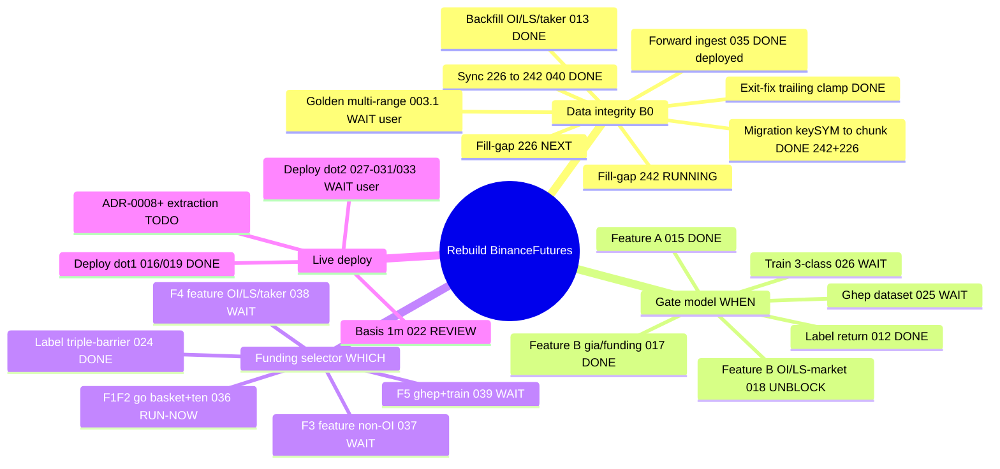
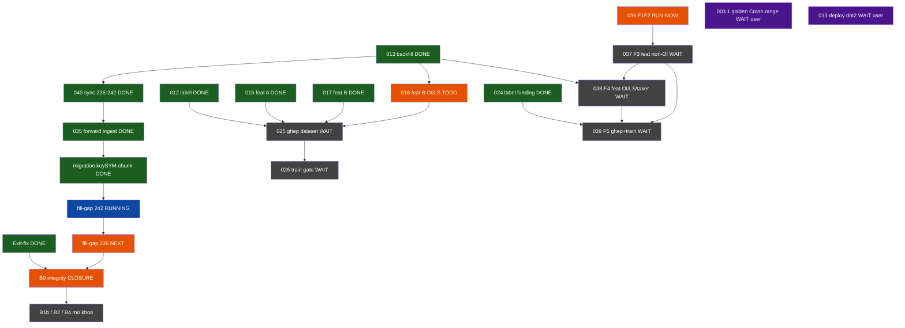

# WORK MINDMAP — trạng thái & phân tích song song (2026-06-16)

> Ảnh chụp trạng thái THỰC sau phiên TASK-035 (forward OI/LS/taker + migration + fill-gap).
> Lưu ý: `docs/AGENTS.md` còn ghi 013/035/040 = TODO — LỆCH thực tế; cần cập nhật (xem cuối file).

## 1. Mindmap tổng (theo nhóm năng lực)

## 2. Chuỗi phụ thuộc + trạng thái (cái gì khoá cái gì)

## 3. Phân tích SONG SONG — làm gì trong lúc fill-gap 242 chạy (~1h)

Nguyên tắc: fill-gap 242 đang poll Binance + ghi 242. Việc song song KHÔNG được đụng (a) Binance REST cùng lúc (đụng guard/ban), (b) ghi nặng vào 226/242.

| Việc | Song song? | Lý do |
|---|---|---|
| 036 F1/F2 (xác minh export path thật + sửa tên feature) | NGAY | Thuần local (đọc code + sửa tên), không đụng Binance/Aerospike. AGENTS ghi "chạy ngay song song". |
| ADR-0008+ extraction (slippage/filter-C/dd4h/AI-filter/funding-decode) | NGAY | Thuần viết tài liệu. |
| Cập nhật AGENTS.md (013/035/040 -> DONE) | NGAY | Doc; đang lệch thực tế. |
| 018 spec (B6 OI-market + B8 LS-market gate feature) | NGAY (chỉ spec) | 013 done -> unblock; viết spec không đụng infra. |
| fill-gap 226 | ĐỢI | Cùng poll Binance với 242 -> đụng guard/gấp đôi tải/ban. Chạy sau khi 242 xong. |
| 037/038 (feature funding Kaggle) | 038 đọc 5 set OI 226 -> đợi fill-gap xong cho data đủ | Tránh đọc khi đang ghi. |
| 025/026 (gate train) | ĐỢI | Cần 018 xong trước. |

Đề xuất: chạy 036 song song ngay (local, tiền đề cho 037/039, và F1 trùng open-item "đường export getTopCoin vs findPotentialLosers" đang treo). Kèm cập nhật AGENTS.md.

## 4. Việc treo cần user quyết (không phải Claude)
- 003.1: chốt độ rộng Crash range (Q2-only vs Q2-Q4).
- 033: duyệt deploy đợt 2 (027/028/029/030/031) — build+runbook sẵn, chỉ restart 2 live.
- 022: chốt dùng basis 1m + schema -> mở B2 backfill.
- 039: chốt target funding (+6%/+40%) trước khi train.
</content>